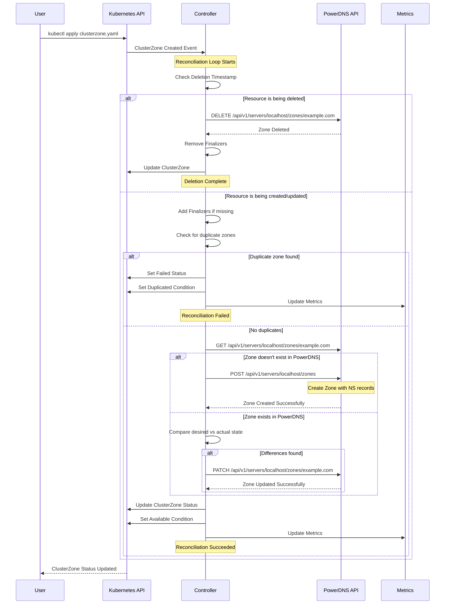

# ClusterZone deployment

## Specification

The `ClusterZone` specification contains the following fields:

| Field | Type | Required | Description |
| ----- | ---- |:--------:| ----------- |
| kind | string | Y | Kind of the zone, one of "Native", "Master", "Slave", "Producer", "Consumer" |
| nameservers | []string | Y | List of the nameservers of the zone |
| catalog | string | N | The catalog this zone is a member of |
| soa_edit_api | string | N | The SOA-EDIT-API metadata item, one of "DEFAULT", "INCREASE", "EPOCH", defaults to "DEFAULT" |
| tsigKeyIds | []string | N | List of TSIG key IDs for RFC2136 DDNS and zone transfers when acting as master |

## Example

```yaml
apiVersion: dns.cav.enablers.ob/v1alpha2
kind: ClusterZone
metadata:
  name: helloworld.com
spec:
  nameservers:
    - ns1.helloworld.com
    - ns2.helloworld.com
  kind: Master
  catalog: catalog.helloworld
  soa_edit_api: EPOCH
```

### Example with RFC2136/TSIG Keys

To enable RFC2136 dynamic DNS updates with TSIG authentication:

```yaml
apiVersion: dns.cav.enablers.ob/v1alpha2
kind: ClusterZone
metadata:
  name: helloworld.com
spec:
  nameservers:
    - ns1.helloworld.com
    - ns2.helloworld.com
  kind: Master
  tsigKeyIds:
    - update-key
    - transfer-key
```

**Note:** TSIG keys can be managed in two ways:
1. Pre-configured in PowerDNS using the PowerDNS API (`/api/v1/servers/{server_id}/tsigkeys`)
2. Managed via Kubernetes using [TSIGKey](tsigkeys.md) or [ClusterTSIGKey](clustertsigkeys.md) resources (recommended)


## Reconciliation Flow

The following diagram illustrates the reconciliation flow for ClusterZone resources:


