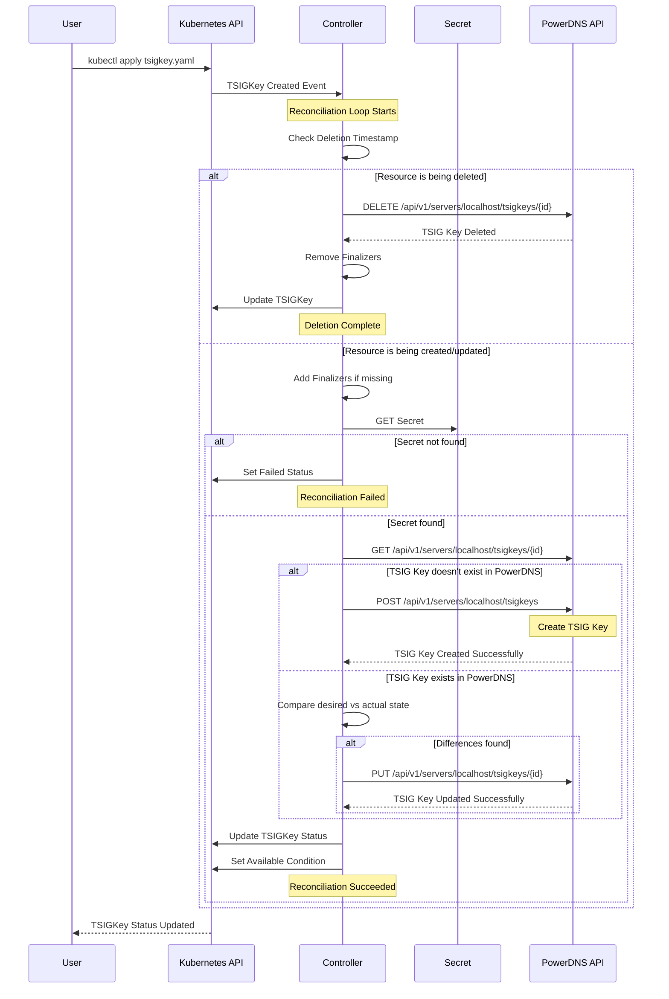

# TSIGKey deployment

## Specification

The `TSIGKey` specification contains the following fields:

| Field | Type | Required | Description |
| ----- | ---- |:--------:| ----------- |
| algorithm | string | Y | Algorithm for the TSIG key, one of "hmac-md5", "hmac-sha1", "hmac-sha224", "hmac-sha256", "hmac-sha384", "hmac-sha512" |
| secretRef | SecretReference | Y | Reference to a Kubernetes Secret containing the TSIG key value |

The `SecretReference` contains:

| Field | Type | Required | Description |
| ----- | ---- |:--------:| ----------- |
| name | string | Y | Name of the secret in the same namespace |
| namespace | string | N | Namespace of the secret (only used for ClusterTSIGKey) |

## Example

### Creating a Secret with the TSIG Key

First, create a Kubernetes Secret containing the TSIG key value:

```bash
kubectl create secret generic my-tsig-key \
  --from-literal=key='your-base64-encoded-key-here' \
  --namespace default
```

### Creating a TSIGKey Resource

```yaml
apiVersion: dns.cav.enablers.ob/v1alpha2
kind: TSIGKey
metadata:
  name: update-key
  namespace: default
spec:
  algorithm: hmac-sha256
  secretRef:
    name: my-tsig-key
```

### Using the TSIG Key in a Zone

Once created, reference the TSIG key in your Zone definition:

```yaml
apiVersion: dns.cav.enablers.ob/v1alpha2
kind: Zone
metadata:
  name: example.com
  namespace: default
spec:
  kind: Master
  nameservers:
    - ns1.example.com
    - ns2.example.com
  tsigKeyIds:
    - update-key
```

## Notes

- The secret must contain a key named `key` with the base64-encoded TSIG key value
- The TSIGKey resource name will be used as the key ID in PowerDNS
- For namespace-scoped TSIGKey resources, the secret must be in the same namespace
- For ClusterTSIGKey resources, you can specify the namespace in the secretRef

## Reconciliation Flow

The following diagram illustrates the reconciliation flow for TSIGKey resources:


